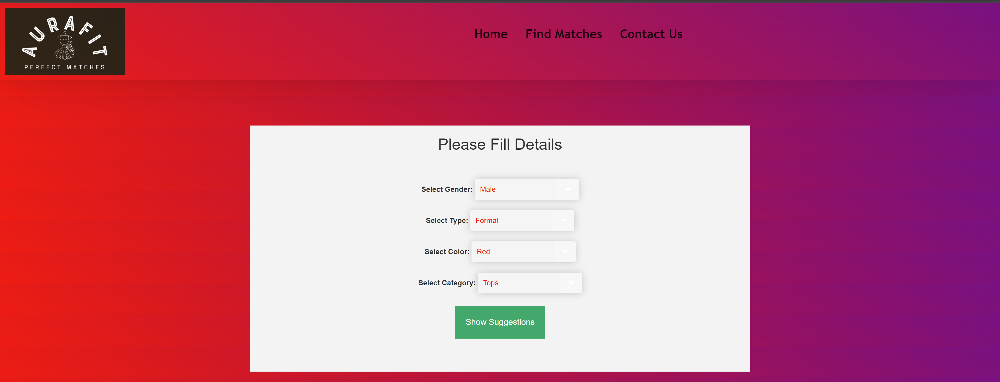
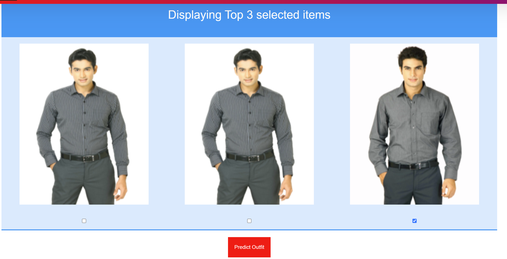
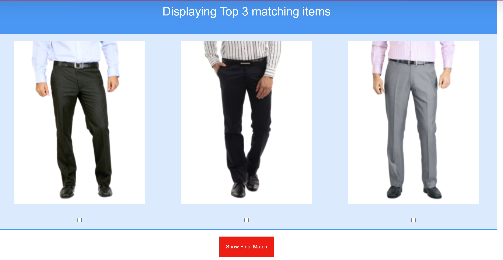
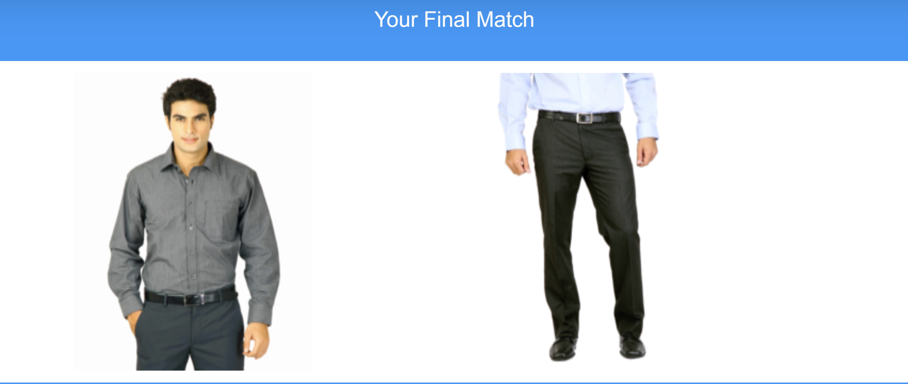

I'm using 2 datasets for my project

Deep Multimodal dataset from: https://github.com/yumingj/DeepFashion-MultiModal
The zalando Research Fashion Dataset (Zalando Fashion MNIST) available at: https://github.com/zalandoresearch/fashion-mnist?tab=readme-ov-file

Initial selection interface:

The selection screen for bottoms or tops based on color:

The images predicted by the recommendation model:

Final output based on user's selection:
